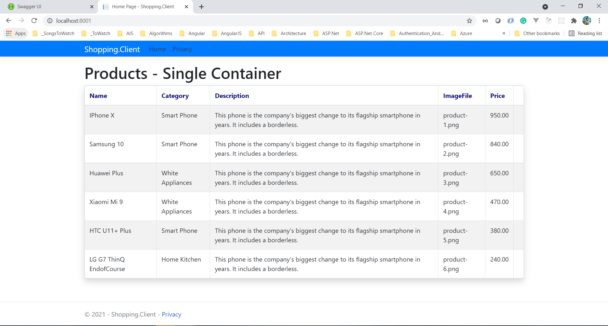

# Deploying .Net Microservices to Azure Kubernetes Services(AKS) and Automating with Azure DevOps
Deploying .Net Microservices into Kubernetes, and moving deployments to the cloud Azure Kubernetes Services (AKS) with using Azure Container Registry (ACR) and how to Automating Deployments with Azure DevOps and GitHub.

## To be done



**docker ps -aq** To get list of container id which are currently running

Trying build from GitHub. 2nd Trail

```
docker login

docker tag df1133 vishipayyallore/shoppingapp
```

**D:\LordKrishna\GitHub\shopping-devops\shopping>**

```
docker-compose -f .\docker-compose.yml -f .\docker-compose.override.yml up

docker-compose -f .\docker-compose.yml -f .\docker-compose.override.yml down
```